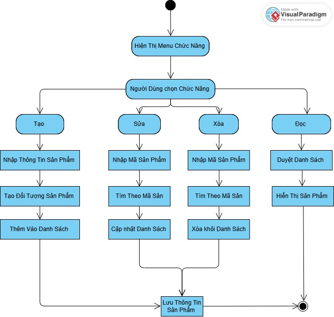
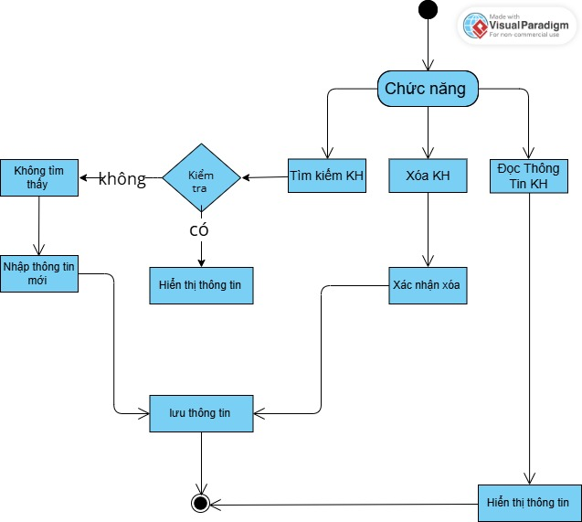
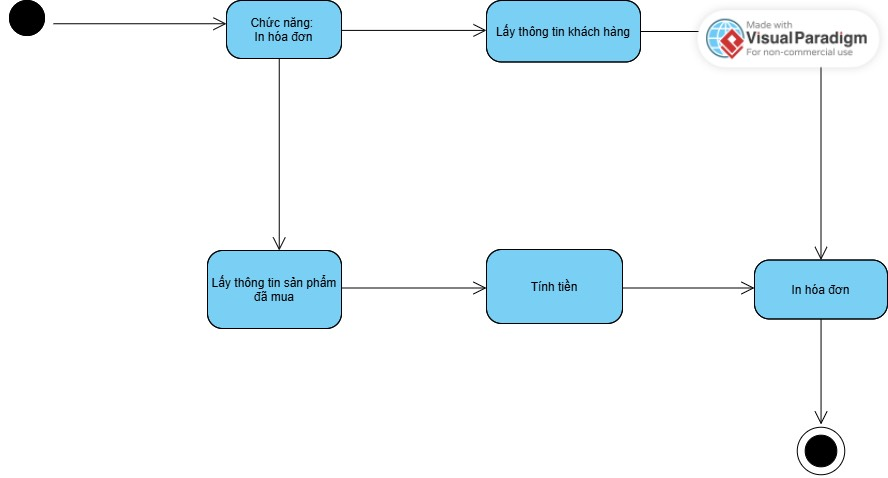

# OOP-N02-T3.2.2025-Group00

#Thanh vien:
Nhom 0:
1. Đào Bá Tuấn Ngọc - 24100498. Githubid: tunngc0941
2. Đào Sơn Tùng - 24100496 Githubid: Stunq41
3. Hồ Đức Hạnh - 24100507 Githubid: hoduchanh2308

Github link to repo: https://github.com/tunngc0941/OOP_N02_T3_2_2025_Group00

Ứng dụng: Quản lý giày

Sơ Đồ Chức Năng 

#Phân tích đối tượng:

SanPham

Sơ đồ hoạt động 

- Ma_SP
- Ten_SP
- Size
- Gia_Ban
- So_Luong

KhachHang

Sơ Đồ Hoạt Động 

-MaKH
- TenKH
- So_Dien_Thoai

DonHang

- Khach_Hang
- San_Pham
- Tong_tien
  

I. Giới thiệu
Trong bài tập cuối kỳ môn lập trình hướng đối tượng, nhóm chúng em xây dựng một ứng dụng quản lý bán giày. Ứng dụng sử dụng các lớp đối tượng như Giay (giày), KhachHang (khách hàng), HoaDon (hóa đơn), và CuaHang (cửa hàng). Dưới đây là 03 phương thức hoạt động chính của hệ thống mà nhóm đã thảo luận và lựa chọn.

II. Ba phương thức hoạt động chính
1. Phương thức thêm sản phẩm giày vào kho

Lớp: CuaHang

Chức năng: Phương thức này cho phép người quản lý nhập thêm giày mới vào kho. Hệ thống lưu thông tin như: mã giày, tên giày, giá bán, và số lượng.

Mục tiêu: Đảm bảo hệ thống có thể cập nhật kho hàng theo thời gian thực, phục vụ việc bán hàng.

2. Phương thức bán giày và cập nhật tồn kho

Lớp: CuaHang

Chức năng: Khi người dùng chọn bán một đôi giày, phương thức này sẽ kiểm tra số lượng tồn kho và trừ đi số lượng đã bán nếu đủ hàng.

Mục tiêu: Kiểm soát tồn kho chính xác, tránh bán vượt số lượng đang có.

3. Phương thức tạo hóa đơn bán hàng

Lớp: CuaHang

Chức năng: Phương thức này ghi nhận thông tin hóa đơn gồm khách hàng, danh sách giày đã mua, số lượng và tổng số tiền thanh toán.

Mục tiêu: Ghi nhận lịch sử mua bán, phục vụ việc in hóa đơn và theo dõi giao dịch sau này.

III. Kết luận
Ba phương thức trên đại diện cho ba hoạt động cốt lõi của một hệ thống bán hàng cơ bản: nhập hàng – bán hàng – ghi nhận giao dịch. Nhóm đã thảo luận kỹ để đảm bảo tính logic, dễ mở rộng và phù hợp với mô hình hướng đối tượng trong Java.

