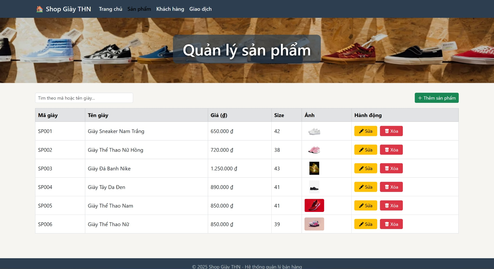
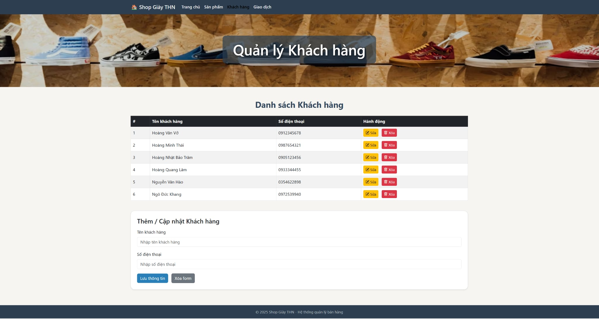
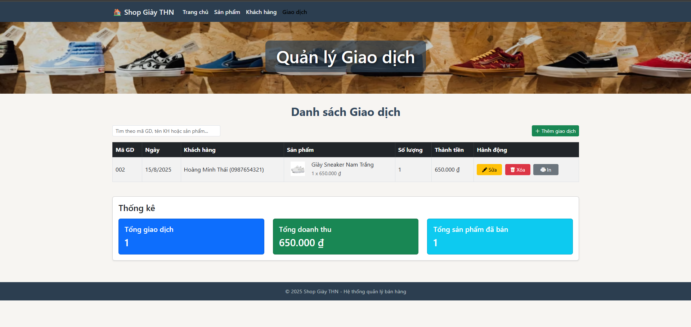

# OOP-N02-T3.2.2025-Group00

#Thanh vien:
Nhom 0:
1. Đào Bá Tuấn Ngọc - 24100498. Githubid: tunngc0941
2. Đào Sơn Tùng - 24100496 Githubid: Stunq41
3. Hồ Đức Hạnh - 24100507 Githubid: hoduchanh2308

Link Team demo Youtube: https://www.youtube.com/watch?v=TMbXYZZLiXk
Github link to repo: https://github.com/tunngc0941/OOP_N02_T3_2_2025_Group00

Ứng dụng: Quản lý giày

Sơ Đồ Chức Năng 

#Phân tích đối tượng:

SanPham

Sơ đồ hoạt động 

- Ma_SP
- Ten_SP
- Size
- Gia_Ban
- So_Luong

KhachHang

Sơ Đồ Hoạt Động 

- TenKH
- So_Dien_Thoai

DonHang

- Khach_Hang
- San_Pham
- Tong_tien
  

I.Giới Thiệu
1. Mục tiêu
Phần mềm quản lý shop bán giày được xây dựng với mục tiêu hỗ trợ chủ cửa hàng và nhân viên tối ưu hóa toàn bộ quy trình bán hàng, từ khâu nhập hàng, quản lý tồn kho, chăm sóc khách hàng đến thống kê doanh thu.
Việc áp dụng hệ thống này sẽ giúp cửa hàng hoạt động chuyên nghiệp, giảm thiểu sai sót và tiết kiệm tối đa thời gian cho cả người quản lý lẫn nhân viên.
Cụ thể, hệ thống hướng tới các mục tiêu sau:
Tự động hóa quy trình quản lý:
 - Quản lý thông tin sản phẩm giày: tên, mã sản phẩm, kích cỡ, màu sắc, giá bán, số lượng tồn.
 - Cập nhật tồn kho tự động sau mỗi giao dịch, giúp hạn chế tình trạng thiếu hoặc thừa hàng.
 - Lưu trữ và truy xuất dữ liệu nhanh chóng mà không cần tìm kiếm thủ công.
Nâng cao hiệu quả bán hàng
 - Hỗ trợ nhân viên tìm kiếm sản phẩm nhanh dựa trên tên, mã hoặc đặc điểm sản phẩm.
 - Tích hợp tính năng lập hóa đơn và in hóa đơn ngay trên hệ thống.
 - Giảm thời gian chờ thanh toán cho khách, cải thiện trải nghiệm mua sắm.
Hỗ trợ chăm sóc khách hàng chuyên nghiệp
 - Lưu trữ thông tin khách hàng và lịch sử mua hàng để dễ dàng áp dụng các chương trình khuyến mãi, tri ân.
 - Tạo cơ sở dữ liệu khách hàng trung thành giúp tăng doanh thu dài hạn.
Cung cấp công cụ phân tích và ra quyết định
 - Xuất báo cáo doanh thu theo ngày, tháng, năm hoặc theo từng sản phẩm.
 - Thống kê sản phẩm bán chạy để đưa ra chiến lược nhập hàng hợp lý.
 - Giúp quản lý dễ dàng đánh giá hiệu quả kinh doanh và điều chỉnh kế hoạch.
Tiết kiệm chi phí, thời gian và nhân lực
 - Giảm thiểu công việc giấy tờ, sổ sách thủ công.
 - Hạn chế sai sót trong tính toán giá và số lượng.
 - Cho phép quản lý giám sát cửa hàng mọi lúc, mọi nơi nếu tích hợp với hệ thống lưu trữ trực tuyến.
Với những mục tiêu trên, phần mềm không chỉ là công cụ quản lý bán hàng mà còn là nền tảng giúp cửa hàng giày nâng cao hình ảnh thương hiệu, phục vụ khách hàng tốt hơn.
 
2. Phạm vi
 Phần mềm bao gồm các chức năng chính như quản lý khách hàng, giao dịch, sản phẩm. Các chức năng cụ thể bao gồm:
-	Thêm,đọc, sửa, xóa thông tin khách hàng
-	Thêm,đọc, sửa, xóa thông tin giao dịch
-	Thêm,đọc, sửa, xóa thông tin sản phẩm

II. Mô tả hệ thống
1. Chức năng chung
Hệ thống Quản Lí Shop Giày THN được thiết kế nhằm hỗ trợ chủ cửa hàng và nhân viên vận hành toàn bộ quy trình kinh doanh một cách nhanh chóng, chính xác và hiệu quả.
 Các chức năng chính bao gồm:
-	Quản lý thông tin sản phẩm giày: tên, mã sản phẩm, size, màu sắc, giá bán, số lượng tồn kho.
-	Quản lý khách hàng và lịch sử mua hàng.
-	Theo dõi và quản lý giao dịch, bao gồm đặt hàng, thanh toán và xuất hóa đơn.
-	Quản lý nhân viên: lưu trữ thông tin, phân công công việc và theo dõi hiệu suất.
-	Thống kê doanh thu, sản phẩm bán chạy, và báo cáo theo thời gian thực.
Hệ thống sử dụng giao diện trực quan, thao tác đơn giản, giúp người dùng mới có thể làm quen nhanh chóng.

2. Chức năng của người quản lý
2.1 Quản lý khách hàng
Thuộc tính:
-	Tên khách hàng
-	Mã khách hàng
-	Số điện thoại
-	Địa chỉ
Chức năng:
-	Thêm mới khách hàng.
-	Hiển thị danh sách khách hàng.
-	Chỉnh sửa thông tin khách hàng.
-	Xóa khách hàng khi cần thiết.

2.2 Quản lý sản phẩm
Thuộc tính:
-	Tên sản phẩm
-	Giá sản phẩm
-	Size và màu sắc
-	Số lượng tồn kho
Chức năng:
-	Thêm mới sản phẩm.
-	Hiển thị thông tin sản phẩm.
-	Chỉnh sửa thông tin sản phẩm.
-	Xóa sản phẩm khỏi hệ thống.
2.3 Quản lý giao dịch
Thuộc tính:
-	Mã giao dịch
-	Sản phẩm
-	Số lượng
-	Thành tiền
-	Ngày giao dịch
Chức năng:
-	Thêm giao dịch mới.
-	Hiển thị danh sách giao dịch.
-	Chỉnh sửa thông tin giao dịch.
-	Xóa giao dịch.

III.Giao diện quản lý bán giày

1.Giao diện chính

2.Giao diện quản lý sản phẩm

3.Giao diện quản lý khách hàng

4.Giao diện quản lý giao dịch

VI. Kết luận
Ba phương thức trên đại diện cho ba hoạt động cốt lõi của một hệ thống bán hàng cơ bản: nhập hàng – bán hàng – ghi nhận giao dịch. Nhóm đã thảo luận kỹ để đảm bảo tính logic, dễ mở rộng và phù hợp với mô hình hướng đối tượng trong Java.

